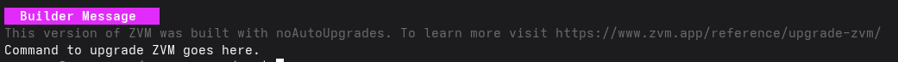

# Install ZVM from GitHub
Your copy of ZVM may ship with an auto-upgrade command. If you have installed ZVM from [GitHub](https://github.com/tristanisham/zvm) or [zvm.app](https://www.zvm.app) you can upgrade to the latest version of ZVM with `zvm upgrade`. 


The latest version of ZVM should install on your machine, regardless of where
your binary lives (though if you have your binary in a privileged folder, you
may have to run this command with `sudo`).

# Install via a package manager
ZVM can also be built without its auto upgrader (`zvm upgrade`). 
This is to make installing ZVM via a package manager easier for those who prefer this method.

When you run a build of ZVM with the autoupgrader disabled, you will see a builder-specified message.



```go

go build -ldflags=-w -s -X 'main.BuildUpgradeMessage=Command to upgrade ZVM goes here.'
```


Remember, ZVM is an open source project. Anyone can customize and distribute it. 

## Clean up build artifacts

```sh
# Example
zvm clean
```

Use `zvm clean` to remove build artifacts (Good if you're on Windows).
